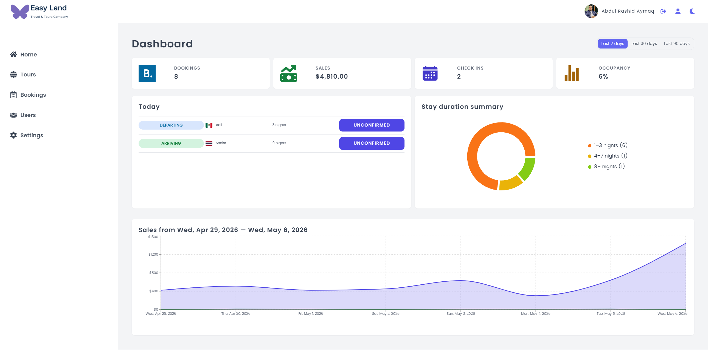
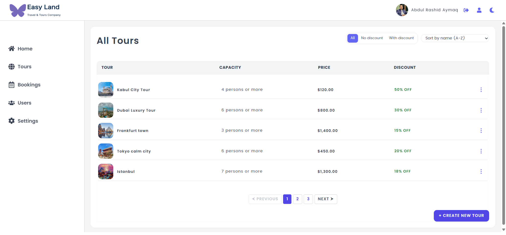

# 📊 SaaS Dashboard

A modern **SaaS Dashboard application** built with **React, Vite, and Styled Components**.  
This project includes authentication, bookings management, tours system, analytics dashboard, and reusable UI components.

---

## 🚀 Live Demo

> (https://easy-land-dashboard.vercel.app/)

---

## 🧰 Tech Stack

- ⚛️ React 19
- ⚡ Vite
- 🎨 Styled Components
- 🔄 React Query (@tanstack/react-query)
- 📊 Recharts (Data Visualization)
- 🧭 React Router v7
- 📝 React Hook Form
- 🔔 React Hot Toast
- 🎯 React Icons
- 📅 date-fns
- 🔑 UUID

---

✨ Features
🔐 Authentication
Login system
Protected routes
Local storage session handling
📊 Dashboard
Analytics overview
Charts using Recharts
Real-time UI updates with React Query
🧳 Tours Management
Create / update / delete tours
Image upload support
Pricing & discount system
📅 Bookings System
Booking list management
Client details & filtering
Pagination support
🌙 UI Features
Dark/Light mode (Context API)
Responsive design
Reusable UI components
🧠 State Management
React Context API (Dark Mode, Auth state)
React Query for server state
LocalStorage persistence
🎨 UI System

Built with a custom component system:

Buttons
Forms
Inputs
Modals
Layout components

Styled using styled-components.

📷 Screenshots

### 🏠 Dashboard

### 📦 Bookings Page

### 📦 Settings Page

👨‍💻 Author

Abdul Rashid Aymaq
Frontend Developer
